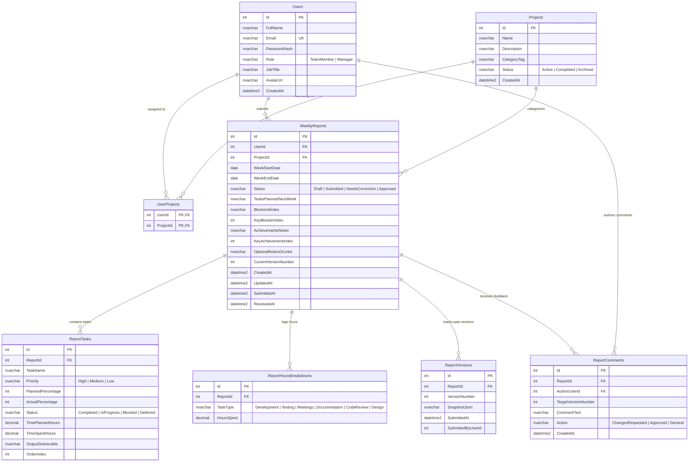

# Entity Relationship Diagram (ERD)

### Weekly Report Generator & Team Dashboard Database Architecture
Target Database: **Microsoft SQL Server (`WeeklyReportDb`)**

---

## 1. Visual Entity Relationship Diagram

---

## 2. Table Specifications & Relationships

### `Users`
- Stores authentication credentials, profile information, and role definitions (`TeamMember` or `Manager`).
- Enforces unique email constraint (`IX_Users_Email`).

### `Projects`
- Captures work initiatives (Client projects, internal tooling, R&D).
- Linked to team members via the `UserProjects` join table.

### `UserProjects`
- Composite primary key (`UserId`, `ProjectId`) defining many-to-many project assignments.
- Cascading deletes ensure orphan mappings are cleaned up when projects or users are removed.

### `WeeklyReports`
- Represents the core weekly report submission for a team member and week date range.
- Enforces strict review status transitions:
  - `Draft` ➔ `Submitted` ➔ `NeedsCorrection` ➔ `Approved`
- Tracks the active version number (`CurrentVersionNumber`), key blocker flag index, and key achievement flag index.

### `ReportTasks`
- Child records linked to a specific weekly report.
- Tracks planned vs actual percentage, task priority, planned hours vs spent hours, deliverable descriptions, and completion status.

### `ReportHoursBreakdowns`
- Stores time allocation across task types (`Development`, `Testing`, `Meetings`, `Documentation`, `CodeReview`, `Design`).

### `ReportVersions`
- Implements Section 3 version history: each time a report goes through a correction cycle and is resubmitted, a snapshot of the report fields and tasks is recorded as JSON with the submission timestamp and user ID.
- Enables managers and team members to review previous iterations side by side.

### `ReportComments`
- Stores feedback left by managers during the review process.
- Records the `TargetVersionNumber` indicating which version the comment was addressed to, and the action (`ChangesRequested` vs `Approved`).
